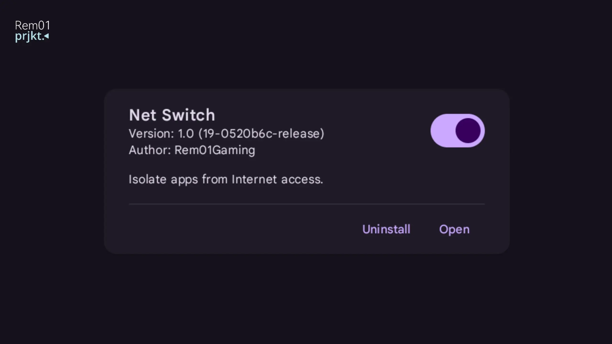
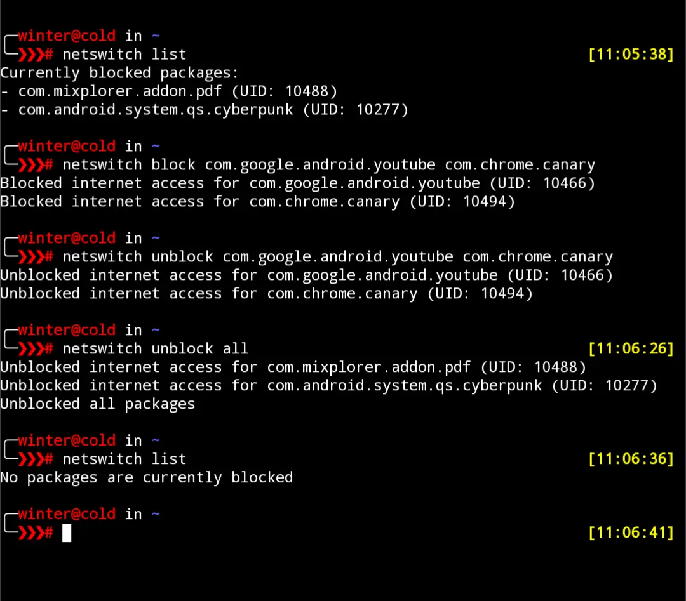

# Net Switch: Isolate Apps from Internet Access


Net Switch is a Magisk module to isolate apps from accessing the internet on your Android device. This tool gives you complete control over which apps can send or receive data, improving security, privacy, and saving bandwidth.

Fully standalone, Operates fully on iptables.

## Features
- Per-app internet isolation setting
- Operates without VPN (unlike AFWall)
- Don't suck on battery
- Module WebUI for easy configuration

## Supported Root Managers
- [APatch](https://github.com/bmax121/APatch) 
- [KernelSU](https://github.com/tiann/KernelSU)
- [Magisk](https://github.com/topjohnwu/Magisk)  <sup>([no WebUI](https://github.com/topjohnwu/Magisk/issues/8609#event-15568590949)👀)</sup>

### WebUI on Magisk
Magisk doesn't support module WebUI on their manager, but you can use one of these app to open Net Switch WebUI.

- [KsuWebUI](https://github.com/5ec1cff/KsuWebUIStandalone)
- [MMRL](https://github.com/DerGoogler/MMRL)   <sup>👍</sup>

## Usage
- Flash Net Switch Module
- Reboot
- Open Net Switch WebUI
- Select apps you wish to isolate. Changes are applied immediately, no need to reboot.

## Terminal Usage
Open Termux or Any Terminal with root access and run
```
netswitch block <package> | to block packages
netswitch unblock <package> | to unblock packages
netswitch list | to show currently blocked packages
netswitch unblock all | to unblock all restricted packages.
```
Terminal Screenshot


## Links
- Download [here](https://github.com/Rem01Gaming/net-switch/releases)
- [Telegram Channel](https://t.me/rem01schannel)

## Help and Support
Report [here](https://github.com/Rem01Gaming/net-switch/issues) if you encounter any issues.

[Pull requests](https://github.com/Rem01Gaming/net-switch/pulls) are always welcome.
